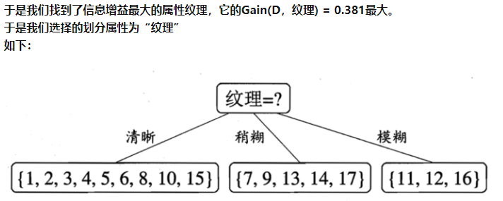

# Decision Tree

> 特别鸣谢：知乎-忆臻

## 信息熵

>  参考来源： https://zhuanlan.zhihu.com/p/26486223

1.  **信息熵公式**

$$
H(X) = -\sum_{i=1}^nP(X_i)log_2P(X_i)
$$

2. 基本约束条件
   * 概率越小的事情发生，信息量越大（熵越大）
   * 若两件事情x, y不相关, 则信息量总和=h(x, y) = h(x)+h(y), 同时发生的概率p(x, y) = p(x)*p(y)-----> 事件发生**概率**和**信息量**为对数有关
   * H(X)=0 ，必然事件, 没有信息量
3. 公式的理解
   * 信息熵==考虑该随机变量的所有可能取值，即所有可能发生事件所带来的信息量的期望
   * 已知事件的所有发生情况，得到的信息量（熵）
   * 应用：根据所有观测值，推测“系统”真实的规律，内在属性。
   * 我们希望将熵（**无序性**）变得小，越小代表事件越确定。

## 条件熵

> 参考资料： https://zhuanlan.zhihu.com/p/26551798

1. 条件熵公式

$$
H(Y|X) = \sum_{x∈X}P(x)H(Y|X=x)
$$

2. 公式的理解
   * 举例： H（Y|X=长相） = p(X =帅)*H（Y|X=帅）+p(X =不帅)*H（Y|X=不帅）
   * 在已知“长相”的条件下，再求一下熵（一定变小，增加了确定因素）
   * **每一个小类里面，都计算一个小熵，然后每一个小熵乘以各个类别的概率，然后求和**
   * 熵H（Y|X）：  已知随机变量X的条件下随机变量Y的不确定性

## 信息增益

1. 公式
   $$
   信息增益= 信息熵-条件熵
   $$

2. 公式理解
   
   * 信息增益 ： 得知属性 a 的信息而使得样本集合**不确定性**(熵)减少的程度

## 决策树

> 参考文献： https://zhuanlan.zhihu.com/p/26760551

## 构造决策树---ID3算法：

1.  每次选取一个属性（特征）， 按照什么标准依次选取特征？

   答： 每次选取**<u>信息增量</u>**最大（**信息不确定性减少的程度最大**）的特征

2. 举例：挑西瓜

   * 给定一组西瓜的特征（颜色、敲声...），和label（好or坏）

   * 数据的信息熵是确定的，只需要求条件熵

     

     

## C4.5算法

### 1、ID3的缺点

信息增益对**可取值较多的属性**偏好明显。（比如颜色，我们分成1000M种颜色，那种他的颜色的条件增益将会非常大（不确定性减少巨多！））， 所以  ID3仅适用于那些每个属性取值数均衡的。

### 2、信息增益率

$$
信息增益率=信息增益/IV(a)
$$

$$
Gain\_Rate =\frac{Gain(D,a)}{IV(a)}
$$

#### 公式解析

* 数据集D

* Gain(D,a)  属性a的信息增益

* IV(a)  属性a的固有值
  $$
  IV(a) = -\sum_{v=1}^V\frac{|D^v|}{D}log_2\frac{|D^v|}{D}
  $$

* **缺点**：信息增益比偏向取值较少的特征

## 决策树的缺点

* 缺点： 
  * 没有限制树的层数，决策数再train set上有100%的accuracy，over fitting问题太过严重（泛化能力极差）。
* solution：限制树的深度， 使用随机森林

# 随机森林

> Tanks： https://zhuanlan.zhihu.com/p/51165358

## 概念介绍

* 随机森林是由许多决策树组成的模型
* 在构建树时对训练数据点进行**随机抽样**(减少噪音对结果的影响)
* 分割节点时考虑特征的随机子集

## 生成过程

* 从原始样本中采取有放回抽样的方法选取n个样本（**数据集的随机选取**）；
* 对n个样本选取a个特征中的**随机k个特征**，用建立决策树的方法获得最佳分割点（**待选特征的随机选取**）；
* 重复m次，获得m个决策树；
* 对输入样例进行预测时，每个子树都产生一个结果，采用**多数投票机制**输出。

## 优点

* 实现简单，训练速度快，可以并行实现，因为训练时树与树之间是相互独立的；
* 相比单一决策树，能学习到特征之间的相互影响，且<u>不容易过拟合</u>
* 能处理高维数据（即特征很多），并且不用做特征选择，因为特征子集是随机选取的；
* 对于不平衡的数据集，可以平衡误差
* 相比SVM，对**特征缺失不敏感**，因为待选特征也是随机选取；
* 训练完成后可以给出哪些特征比较重要
* 可回归，可分类

## 缺点

* 在噪声过大的分类和回归问题还是容易过拟合
* 相比于单一决策树，它的随机性让我们难以对模型进行解释（**模型可解释性差**）

# GBDT

## 概念介绍

* 迭代树，仅可**回归树**
* Gradient Boost Decision Tree :梯度提升决策树'
* 每一棵树学的是之前所有树结论和的**残差**，这个残差就是一个加预测值后能得真实值的**累加量**。
* example： 比如A的真实年龄是18岁，但第一棵树的预测年龄是12岁，差了6岁，即残差为6岁。那么在第二棵树里我们把A的年龄设为6岁去学习，如果第二棵树真的能把A分到6岁的叶子节点，那累加两棵树的结论就是A的真实年龄；如果第二棵树的结论是5岁，则A仍然存在1岁的残差，第三棵树里A的年龄就变成1岁，继续学习。

## 优缺点

* 优点： 
  * 离散或连续的数据都可以处理，几乎可用于所有回归问题（线性/非线性），亦可用于二分类问题（设定阈值，大于阈值为正例，反之为负例）
  * 通过减少模型偏差提高性能
* 缺点： 
  * 由于弱分类器的**串行依赖**，导致难以并行训练数据
  * 对异常值非常敏感

# XGBoost

## 概念介绍

1. bagging： 每一次从原始数据中根据**均匀概率分布有放回的抽取和原始数据大小相同的样本集合**，样本点可能出现重复，然后对每一次产生的训练集构造一个分类器，再对分类器进行组合。
2. boosting： 每一次抽样的**样本分布都是不一样的**。每一次迭代，都根据上一次迭代的结果，**增加被错误分类的样本的权重**，使得模型能在之后的迭代中更加注意到难以分类的样本，这是一个**不断学习的过程，也是一个不断提升**的过程，

