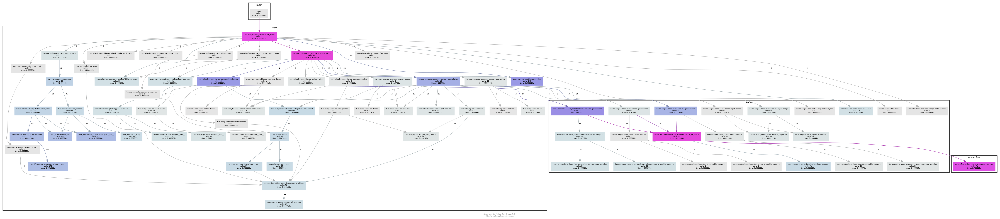

## 1. 模型导入

~~~python
mod, params = relay.frontend.from_keras(predict_model, shape_dict)
~~~

## 2. 函数调用关系图

## 3. IPO

1. input: 一个训练好的model

2. process： 转化为一个通用的中间表示ir

3. output： 

   - mod: 计算图结构的功能函数（后续优化的对象）
   - params: model的权重信息

## 4. 详细分析

> from_keras() 将遍历model的所有layers,将其转化为relay ir，（需要特殊处理input_layer）

### 5、主要调用关系

注：namespace： tvm.relay.frontend

- 每个layer都要调用`keras_op_to_relay`    
- 匹配layer详细内容，逐个转换 (以dense为例)
  - call `keras_convert_dense`
    - call `common.ExprTable.new_const`
      - call `tvm.relay.expr.var`
        - call `tvm.runtime.object_generic`
    - call `op.nn.nn.dense`  
    - call `nn.nn.bias_add`

## 6. 结论

**relay.op.nn** 中注册了所有常用的operator的定义，和与所有dl frameworks的转化过程。