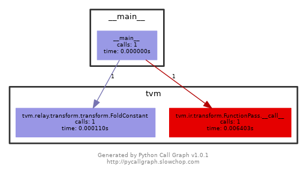

## 1. 强拆Relay ir Pass

~~~python
fold_const = relay.transform.FoldConstant()  # 返回类型pass
mod = fold_const(mod)  # 执行pass
~~~

## 2. 函数调用关系图



## 3. IPO

1. input: IRModule

2. process： pass优化

3. output： IRModule


## 4. pass data structure

> 对于通用数据结构的定义均在目录`tvm/ir`中， 执行pass 是一个module到module的映射

pass = PassInfo + passContext + PassConstructs 


## 5、pass分类

- high-level pass:
  - header file: `include/tvm/relay/transforms.h` 
  - src files: `src/relay/pass` 
  - python: `python/tvm/relay/transform.py`

- low-level pass:
  - header file `include/tvm/tir/ir_pass.h` 
  - src files: `src/tir/pass` 
  - python: `python/tvm/tir/ir_pass.py`

本次仅仅讨论high-level pass, 对relay ir进行优化

## 6. 使用方法

- 显示使用

  ```python
  optimize_my = relay.transform.pass_name（）
  optimize_my = relay.transform.Sequential([ pass_name(), pass_name2(),...])  # 方法二
  
  mod = optimize_my(mod)
  ```

- 隐式调用

  ```python
  with tvm.transform.PassContext(opt_level=3):
      lib = relay.build(func, target, params=params)
  ```


  - relay.build() 内部将会调用`Optimize` （location： /relay/backend/build_module）调用一系列pass 进行优化
